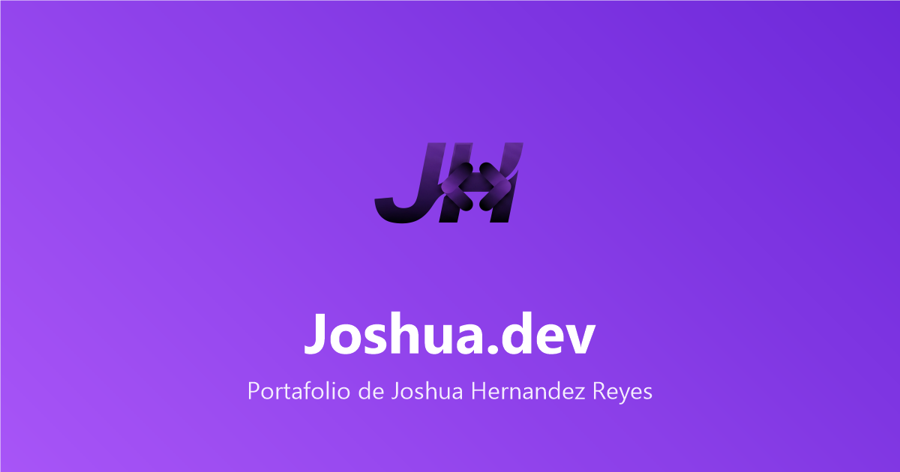

# Portafolio de Joshua Hernandez Reyes

Portafolio web personal de Joshua Hernandez Reyes, desarrollador web de Tuxtla Gutiérrez, Chiapas. Sitio estático con HTML, CSS y TypeScript, desplegado en Vercel.



## 🌐 Sitio en vivo

- **Deploy:** https://portafolio-joshua-three.vercel.app
- **Proyecto destacado — Origen Lab:** https://origenlab.up.railway.app

## ✨ Características

- Diseño responsivo con modo claro/oscuro (con preferencia del sistema).
- Animaciones suaves: cursor glow, reveal al hacer scroll, partículas y efectos 3D.
- SEO optimizado: meta tags Open Graph/Twitter, `sitemap.xml`, `robots.txt` y datos estructurados.
- Formulario de contacto funcional vía Web3Forms.
- Página 404 personalizada.

## 🛠️ Stack

- HTML5, CSS3 (variables, animaciones)
- TypeScript
- Vercel (deploy estático)

## 🚀 Ejecutar en local

```bash
# 1. Clonar el repositorio
git clone https://github.com/joshuareyws-prog/portafolio-joshua.git

# 2. Instalar dependencias (solo TypeScript)
npm install

# 3. Compilar el TypeScript
npm run build

# 4. Abrir public/index.html en el navegador
```

## 📁 Estructura

```
public/          Sitio final: HTML, CSS, JS compilado y assets
src/ts/          Código fuente TypeScript (organizado en ui/, effects/, animations/)
public/assets/   Imágenes, CV y estilos
```

## 📬 Contacto

- WhatsApp: https://wa.me/529921044338
- Instagram: https://www.instagram.com/hdzz_ry
- GitHub: https://github.com/joshuareyws-prog
